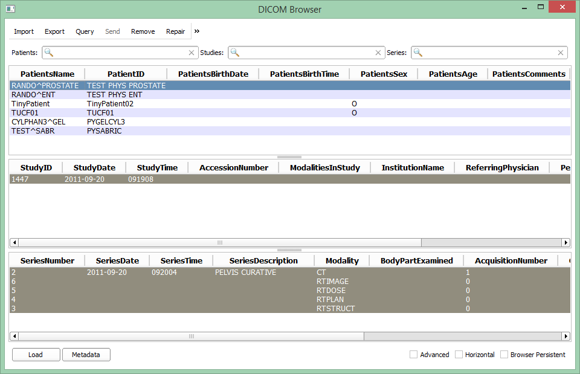

# DICOM-RT Import

The DicomRtImport module enables importing and loading DICOM RT files into the Slicer DICOM database and the Slicer scene.

DicomRtImport does not have a separate module GUI. Instead, it is a DICOM import plugin that extends the DICOM module.
When the user selects a patient in the DICOM management module interface, the import mechanism allows each DICOM import module to interpret the data. The DICOM import modules parse the data and return a list of items that they can read from the selected DICOM objects. This module will return with the RT objects. The DICOM module displays the consolidated list of all loadable objects to the user, and loads the items that are selected by the user.

Authors: Andras Lasso (PerkLab, Queen's University), Steve Pieper (Isomics), Kevin Wang (Princess Margaret Cancer Centre), Csaba Pinter (PerkLab, Queen's University)

# Use Cases

Import and load DICOM RT data

DICOM browser with SlicerRT:

# Tutorials

See SlicerRT main page

# Information for developers

- Custom attributes: https://github.com/SlicerRt/SlicerRT/blob/master/SlicerRtCommon/vtkSlicerRtCommon.cxx#L63

## Acknowledgements

This work is part of the SparKit project, funded by An Applied Cancer Research Unit of Cancer Care Ontario with funds provided by the Ministry of Health and Long-Term Care and the Ontario Consortium for Adaptive Interventions in Radiation Oncology (OCAIRO) to provide free, open-source toolset for radiotherapy and related image-guided interventions.
