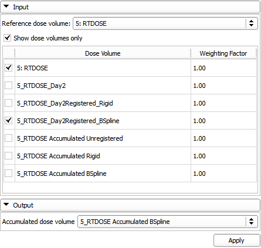

# Dose Accumulation

The DoseAccumulation module computes accumulated dose for multiple input dose volumes as a weighted sum of the dose values. The weight of each input volume is specified in the module’s user interface. The dose volumes have to be spatially aligned prior the dose accumulation to obtain a meaningful summation. This can be achieved by utilizing image registration algorithms already available in the 3D Slicer core.
First, the alignment transformation is computed by registering the anatomical volumes and then the same transformation is applied to the corresponding dose volumes.

## Use Cases

Evaluate total delivered dose for multiple treatment fractions.

## Tutorials

See SlicerRT extension page

## Panels and their use

- Input
  - Reference dose volume: The output dose volume will have the same size, spacing, position, and orientation as the reference dose volume and will have the same dose unit. Voxel values of the reference dose volume do not influence the output.
  - Show dose volumes only: If checked, only the volumes that have been created by a SlicerRT module (such as DicomRtImport or DoseAccumulation) are displayed
  - Dose volume table
    - The checked dose volumes are accumulated
    - Weight can be assigned to the dose distributions for the accumulation
- Output
  - Accumulated dose volume: The output volume
  - Apply: Compute accumulated dose and save it in the output volume

Dose accumulation module UI:

## Information for developers

Custom attributes:
- DicomRtImport.DoseVolume: identifier attribute that is set to each imported dose volume. Facilitates easier distinction between dose and non-dose volumes (without tampering in the Patient Hierarchy tree, see below)
- DicomRtImport.DoseUnitName: set in the study of each imported dose volume, the value of this attribute is read from the Dose Units (3004,0002) attribute of the RTDOSE DICOM volume
- DicomRtImport.DoseUnitValue: set in the study of each imported dose volume, the value of this attribute is read from the Dose Grid Scaling (3004,000E) attribute of the RTDOSE DICOM volume. This value defines a scaling factor to convert the integer voxel values of the dose volume in the DICOM file to real dose values. This conversion is performed during DICOM importing, but this value is stored to let other modules know what was the original scaling factor

## Acknowledgements

This work is part of the SparKit project, funded by An Applied Cancer Research Unit of Cancer Care Ontario with funds provided by the Ministry of Health and Long-Term Care and the Ontario Consortium for Adaptive Interventions in Radiation Oncology (OCAIRO) to provide free, open-source toolset for radiotherapy and related image-guided interventions.
