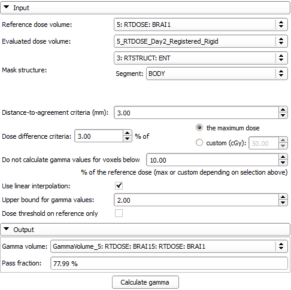
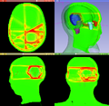

# Dose Comparison

The DoseComparison module computes the difference between two co-registered dose volumes using the gamma dose distribution comparison method. This module uses the gamma Plastimatch algorithm internally.

Author: Csaba Pinter (Ebatinca)
Contributor: Greg Sharp (Massachusetts General Hospital)

## Use Cases

Comparing dose distributions

Dose Comparison module UI:

Example of the result gamma volume:

## Tutorials

See SlicerRT main page

## Panels and their use

- Reference dose volume: Dose distribution used as reference
- Evaluated dose volume: Dose distribution used as evaluation/compare
- Mask structure: Segmentation and contained segment within which the gamma index is calculated, but not outside (it will be 0)
- Distance-to-agreement (DTA): Mark dose voxel as failed if closest dose voxel with same value found in distance higher than this threshold, see Low paper below
- Dose difference criteria: Mark dose voxel as failed if dose difference is equal or greater than this threshold, see Low paper below
  - Maximum value / Custom: Reference dose value for threshold can be either the maximum dose in the dose map, or a custom cGy value
- Do not calculate gamma values for voxels below analysis threshold
- Use linear interpolation
- Upper bound for gamma values: If gamma value would be higher than this value, the value will be set instead
- Dose threshold on reference only
- Gamma volume: Output volume to contain gamma map. Needs to be created using the combobox. Name will be automatically filled from the names of the input volumes

## Similar Modules

- Segment Comparison

## References

- General information about the algorithm
  - Low, D. A.; Harms, W. B.; Mutic, S. & Purdy, J. A. A technique for the quantitative evaluation of dose distributions Med. Phys, 1998, 25 (5), 656/6
  - Low, D. A. & Dempsey, J. F. Evaluation of the gamma dose distribution comparison method Med. Phys, 2003, 30 (9), 2455/10
- Cross-validation of the SlicerRT gamma calculation algorithm
  - [Alexander, K. M., Jechel, C., Pinter, C., Salomons, G., Lasso, A., Fichtinger, G., & Schreiner, L. J. (2015). SU‐E‐T‐231: Cross‐Validation of 3D Gamma Comparison Tools. Medical physics, 42(6Part15), 3385-3385.](http://perk.cs.queensu.ca/sites/perkd7.cs.queensu.ca/files/Alexander2015_AAPM_Gamma.pdf)

## Acknowledgements

This work is part of the SparKit project, funded by An Applied Cancer Research Unit of Cancer Care Ontario with funds provided by the Ministry of Health and Long-Term Care and the Ontario Consortium for Adaptive Interventions in Radiation Oncology (OCAIRO) to provide free, open-source toolset for radiotherapy and related image-guided interventions.
