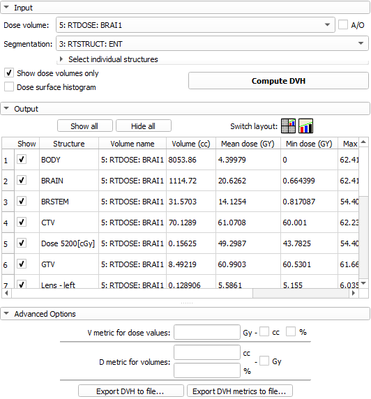
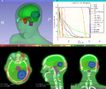
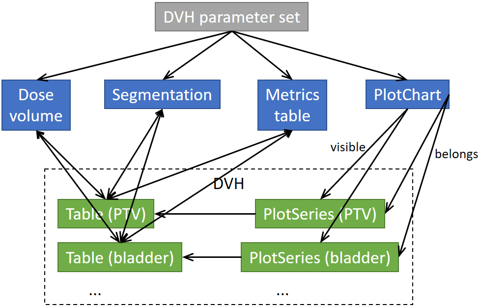

# Dose Volume Histogram

The Dose Volume Histogram module enables the user to compute and display the DVH curve from a dose volume and structure (set). DVH metrics, such as volume, minimum, maximum and mean dose, Vdose (the volume that is radiated by a dose greater than a specified dose), and Dvolume (the minimum dose in the most exposed portion of a certain volume in a structure) can be also computed.

The dimensions of the 3D elements (voxels) describing delineated structures are derived from the selected dose distribution volume, in which the voxels have width in the transverse imaging plane as described in the DICOM image header. The image set volume is defined by a grid of voxels derived from the voxel grid in the dose volume. The dose grid is oversampled by a factor currently fixed to the value 2.
The centre of each voxel is examined and if found to lie within a structure, is included in the volume for that structure. The dose value at the centre of the cube is interpolated in 3D from the dose grid.

Contact: Csaba Pinter

## Use Cases

Evaluate single or accumulated dose distributions against target structures and organs at risk (OARs)

Dose Volume Histogram module UI:

Dose volume histogram views using SlicerRT:

## Tutorials

- Workflow tutorials involving DVH on the main page
- [Dose surface histogram tutorial](https://github.com/SlicerRt/SlicerRtDoc/blob/master/tutorials/SlicerRT_Tutorial_DoseSurfaceHistogram.pptx)

## Panels and their use

- Input
  - Dose volume: The dose distribution using which the DVH is computed and the structure labelmap is created if necessary. All the volumes present in the Slicer scene appear here, however, when selecting a volume that has not been created by a SlicerRT module (such as DicomRtImport or DoseAccumulation), a warning will be displayed. If using such a volume, it is assumed not to contain dose values, so an Intensity Volume Histogram is created.
  - Structure set: A contour or a contour hierarchy can be selected for which the DVH tables are computed. In case of a hierarchy, the DVH is computed for every contained contour.
  - Dose surface histogram: If checked, then dose surface histogram (DSH) is calculated instead of a DVH. A current limitation is that open contours are not supported, so for example rectum structure bottom and top is considered.
- Output
  - Show/hide all: After computing histograms, this checkbox adds or removes every histogram from the chart
  - Switch layout: Switch layout to "four-up quantitative interactive" or "one-up quantitative interactive" so that DVH/DSH chart is visible
  - DVH table
    - Checkbox: show/hide that specific structure in the selected chart
    - Structure data and computed DVH metrics appear in the columns
- Advanced options
  - V metric for dose values: Values can be entered separated by commas. If 'cc' or '%' is checked, then the V metric for all structures according the entered values will appear in the DVH table in the checked unit(s)
  - D metric for volumes: Values can be entered separated by commas in either ccs or percents. If 'Gy' is checked then the D metric for the entered volumes are displayed in the DVH table
  - Export DVH to file: The currently plotted DVH tables are saved in CSV format
  - Export DVH metrics to file: The currently displayed DVH table can be exported in CSV format

## Similar Modules

- DVH Comparison

## References

- Pinter, C.; Lasso, A.; Wang, A.; Jaffray, D. & Fichtinger, G. SlicerRT: Radiation therapy research toolkit for 3D Slicer Med. Phys., 2012, 39(10), 6332/7
- Ebert, M. A.; Haworth, A.; Kearvell, R.; Hooton, B.; Hug, B.; Spry, N. A.; Bydder, S. A. & Joseph, D. J. Comparison of DVH data from multiple planning systems Phys. Med. Biol., 2010, 55, N337–N346
- Drzymala, R. E.; R. Mohan, l. B.; Chu, J.; Goitein, M.; Harms, W. & Urie, M. Dose-Volume Histograms Radiation Oncology Biol. Phys., 1991, 21, 71-78

## Information for Developers

Dose Volume Histogram nodes architecture:

## Acknowledgements

This work is part of the SparKit project, funded by An Applied Cancer Research Unit of Cancer Care Ontario with funds provided by the Ministry of Health and Long-Term Care and the Ontario Consortium for Adaptive Interventions in Radiation Oncology (OCAIRO) to provide free, open-source toolset for radiotherapy and related image-guided interventions.
