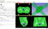
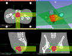
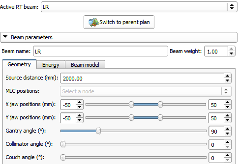
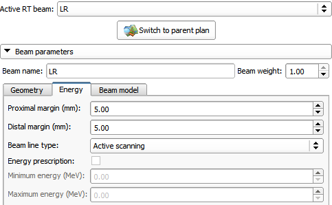
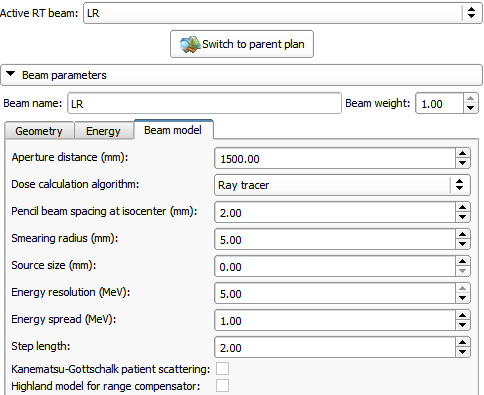

# External Beam Planning

The ExternalBeamPlanning module is a generic, extensible module for forward planning of external beam radiation therapy treatments.

- Author: Csaba Pinter (PerkLab, Queen's University), Greg Sharp (Massachusetts General Hospital)
- Contact: Csaba Pinter

## Use Cases

- Proton dose calculation:
- Any dose engine can be integrated (C++, Python, Matlab):

External Beam Planning module UI with a prostate proton plan:

Output dose of the plan:

## Panels and their use

- External Beam Planning module
  - Basic plan data: Reference volume, Structure set, Isocenter, Target volume, Dose engine, Prescription dose
  - Beam list
- Beams module: edit parameters of individual beams
  - Geometry
  - Energy (extensible by plugins)
  - Beam model (extensible by plugins)

Beam geometry parameters:

Beam energy parameters (including proton-specific parameters):

Beam model parameters (including proton-specific parameters):

## Tutorials

[Orthovoltage RT treatment planning tutorial](https://github.com/SlicerRt/SlicerRtDoc/blob/master/tutorials/SlicerRT_Tutorial_OrthovoltageDoseEngine.pptx) (uses EGSnrc)

## Information for Developers

- Sample C++ dose engine: https://github.com/SlicerRt/SlicerRT/blob/master/ExternalBeamPlanning/Widgets/qSlicerMockDoseEngine.h
- Sample Python dose engine: https://github.com/SlicerRt/SlicerRT/blob/master/ExternalBeamPlanning/Widgets/Python/MockPythonDoseEngine.py

## References

- Sharp, G., Pinter, C., Unkelbach, J., Fichtinger, G. (2017). Open Source Proton Treatment Planning in 3D Slicer: Status Update. Proceedings to the 56 Annual Meeting of the Particle Therapy Cooperative Group (PTCOG), 8-13 May 2017. International Journal of Particle Therapy: Summer 2017, Vol. 4, No. 1, pp. 14-83.

## Acknowledgments

This work was in part funded by An Applied Cancer Research Unit of Cancer Care Ontario with funds provided by the Ministry of Health and Long-Term Care and the Ontario Consortium for Adaptive Interventions in Radiation Oncology (OCAIRO) to provide free, open-source toolset for radiotherapy and related image-guided interventions.

