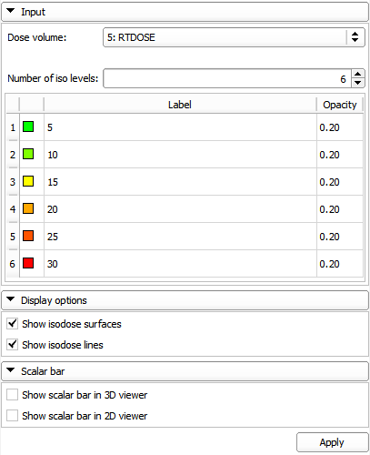
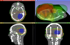

# Isodose

The Isodose module creates isosurfaces from an input dose volume and a series of defined isodose levels. The output is a series of surface models grouped under a hierarchy node parent that can be visualized either in the 3D viewer or overlaid on image slices.

Author: Kevin Wang (Princess Margaret Cancer Centre)

## Use Cases

Generate isodose lines and surfaces for a dose distribution

Isodose module UI:

Isodose views:

## Tutorials

  - See workflow tutorials involving DVH on the SlicerRT main page
  - [Isodose tutorial](https://github.com/SlicerRt/SlicerRtDoc/blob/master/tutorials/SlicerRT_Tutorial_Isodose.pptx)

## Panels and their use

- Input
  - Dose volume
  - Number of Iso levels
  - Iso levels table: Color, Label and Opacity can be set to the isodose surfaces individually
  - Apply: Create isodose surfaces
- Display options
  - Show isodose lines: Show/hide isodose lines in 2D slice viewers
  - Show isodose surfaces: Show/hide isodose surfaces in the 3D view

## Acknowledgements

This work is part of the SparKit project, funded by An Applied Cancer Research Unit of Cancer Care Ontario with funds provided by the Ministry of Health and Long-Term Care and the Ontario Consortium for Adaptive Interventions in Radiation Oncology (OCAIRO) to provide free, open-source toolset for radiotherapy and related image-guided interventions.
