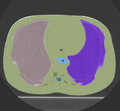
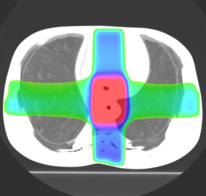

# Plastimatch Automatic deformable image registration

This is the plastimatch automatic (B-spline) deformable image registration module. It includes a multi-stage, multi-resolution pipeline, as well as multicore and GPU acceleration. Compared to other B-spline methods in 3d slicer, the plastimatch registration method might offer:

1. superior accuracy for CT-CT (or CT-CBCT) registration
2. faster results for MSE registration

However, to date there have been no rigorous comparisons of the various 3D Slicer registration methods.

Examples of how this module is being used:
- Intra-subject registration for adaptive radiotherapy
- Inter-subject registration for automatic segmentation

Author: Greg Sharp (Department of Radiation Oncology, Massachusetts General Hospital), Julien Finet (Kitware)

## Use cases

DICOM-RT Structure Set:

DICOM-RT Dose:

## Panels and their use

- Input/Output panel:
  - Fixed Volume: Here you choose the "fixed image", which is the reference image.
  - Moving Volume: Here you choose the "moving image", which will be warped to match the fixed image.
  - Output Volume: Here you choose where to put the warped image.  You can replace an existing image in the scene, or create a new image.
  - Cost Function: Here you can choose either Mean-squared error (MSE) for unimodal registration, or Mutual Information (MI) for multimodal registration.
  - Hardware: Here you can choose either GPU for CUDA-accelerated registration, or CPU for multicore-accelerated registration.
- Stage 0 panel: Stage 0 is the a pre-alignment stage, which uses either a translation, rigid transform, or affine transform to make a rough alignment of the moving image to the fixed image.  The default is not to do pre-alignment.  If your images are reasonably well aligned you can keep this option off, which makes plastimatch run faster.  But generally it doesn't hurt to enable Stage 0.
  - Enable Stage 0:  Click on this checkbox to enable the pre-alignment stage.
  - Image Subsampling Rate:  This option is specified as three integers, separated by commas.  It tells plastimatch to subsample the images in the (x,y,z) dimensions by this amount for this stage.  This is one of the methods that plastimatch implements multi-resolution registration. by cascading stages of different subsampling rates.
  - Max Iterations: This option controls how many iterations of B-spline registration will be run in this stage.  Usually there is no benefit beyond 200 iterations.  Also, there is usually no harm in running extra iterations, except that it takes longer.
  - Transformation: This option controls whether the pre-alignment uses a translation (3 DOF), a rigid transform (6 DOF), or an affine transform (12 DOF).  Generally speaking, translation is recommended unless the images are extremely different.
- Stage 1 panel: Stage 1 is the first stage of non-rigid registration.  The plastimatch plugin will always do at least one non-rigid stage.
  - Image Subsampling Rate:  This option is specified as three integers, separated by commas.  It tells plastimatch to subsample the images in the (x,y,z) dimensions by this amount for this stage.  This is one of the methods that plastimatch implements multi-resolution registration. by cascading stages of different subsampling rates.
  - Max Iterations: This option controls how many iterations of B-spline registration will be run in this stage.  Usually there is no benefit beyond 200 iterations.  Also, there is usually no harm in running extra iterations, except that it takes longer.
  - Grid Spacing: The grid spacing parameter is a floating point number which controls the size of the B-spline control grid, in mm.  Larger spacing means a smoother registration, while smaller spacing means a finer registration.
- Stage 2 panel:  Stage 2 is an optional second round of non-rigid registration.  If you get good results after stage 1, you might try stage 2 to further improve the results.  However, enabling stage 2 increases the time required to perform the registration.
  - Enable Stage 2:  Click on this checkbox to enable stage 2.
  - Image Subsampling Rate:  This option is specified as three integers, separated by commas.  It tells plastimatch to subsample the images in the (x,y,z) dimensions by this amount for this stage.  This is one of the methods that plastimatch implements multi-resolution registration. by cascading stages of different subsampling rates.
  - Max Iterations: This option controls how many iterations of B-spline registration will be run in this stage.  Usually there is no benefit beyond 200 iterations.  Also, there is usually no harm in running extra iterations, except that it takes longer.
  - Grid Spacing: The grid spacing parameter is a floating point number which controls the size of the B-spline control grid, in mm.  Larger spacing means a smoother registration, while smaller spacing means a finer registration.

## Tutorials

- [Download tutorial](https://github.com/SlicerRt/SlicerRtDoc/blob/master/tutorials/3D_Slicer_Plastimatch_Registration_2015_12_29.pdf)
- [Download tutorial data](https://github.com/SlicerRt/SlicerRtData/tree/master/rider-lung-images)

Retrieved from "https://www.slicer.org/w/index.php?title=Documentation/Nightly/Modules/PlmBSplineDeformableRegistration&oldid=28299"

## References

- G Sharp, N Kandasamy, H Singh, M Folkert, "GPU-based streaming architectures for fast cone-beam CT image reconstruction and demons deformable registration," Physics in Medicine and Biology, 52(19), pp 5771-83, 2007.
- V Boldea, G Sharp, SB Jiang, D Sarrut, "4D-CT lung motion estimation with deformable registration: Quantification of motion nonlinearity and hysteresis," Medical Physics, 33(3), pp 1008-18, 2008.
- Z Wu, E Rietzel, V Boldea, D Sarrut, G Sharp, "Evaluation of deformable registration of patient lung 4DCT with sub-anatomical region segmentations," Medical Physics, 35(2), pp 775-81, 2008.
- G Sharp et al. "Plastimatch - An open source software suite for radiotherapy image processing," Proceedings of the XVIth International Conference on the use of Computers in Radiotherapy, May, 2010.

## Acknowledgements

- An Ira J Spiro translational research grant (2009)
- NIH / NCI 6-PO1 CA 21239
- The Federal share of program income earned by MGH on C06CA059267
- Progetto Rocca Foundation – A collaboration between MIT and Politecnico di Milano
- The National Alliance for Medical Image Computing (NAMIC), funded by the National Institutes of Health through the NIH Roadmap for Medical Research, Grant 2-U54-EB005149; information on the National Centers for Biomedical Computing can be obtained from http://nihroadmap.nih.gov/bioinformatics
- NSF ERC Innovation Award EEC-0946463

Webpage: www.plastimatch.org
