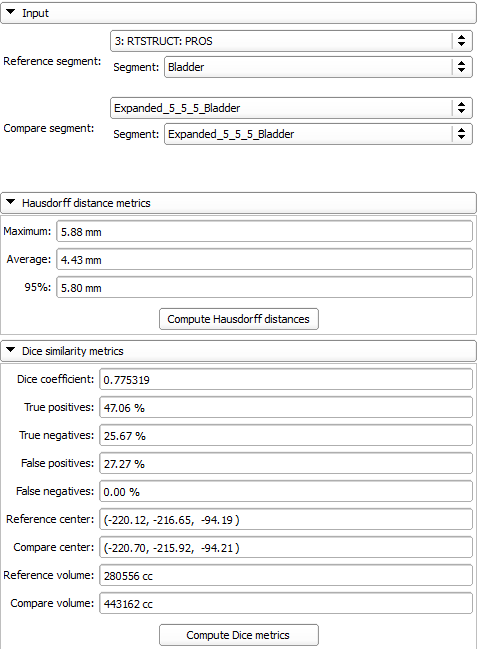

# Segment Comparison

The SegmentComparison module provides comparison metrics for segments (i.e. contours, structures)

Author: Csaba Pinter (Ebatinca)

## Use Cases

- Compare segments using Hausdorff distances
- Compare segments using Dice similarity metrics

Segment comparison module GUI:

## Tutorials

See SlicerRT extension page

## Panels and their use

- Input
  - Reference segment: The input structure that serves as reference for the comparison. Select segmentation first, then the individual segment
  - Compare segment: The input structure that serves as the second input (compare) for the comparison. Select segmentation first, then the individual segment
- Hausdorff distance metrics
  - Compute Hausdorff distances button: Click this to compute Hausdorff distances on the specified input structures
- Dice similarity metrics
  - Compute Dice metrics button: Click this to compute Dice similarity metrics on the specified input structures

## References

- Information about the Plastimatch Hausdorff algorithm used [here](http://plastimatch.org/doxygen/classHausdorff__distance.html)
- Information about the Plastimatch Dice algorithm used [here](http://plastimatch.org/doxygen/classDice__statistics.html)

## Acknowledgements

This work is part of the SparKit project, funded by An Applied Cancer Research Unit of Cancer Care Ontario with funds provided by the Ministry of Health and Long-Term Care and the Ontario Consortium for Adaptive Interventions in Radiation Oncology (OCAIRO) to provide free, open-source toolset for radiotherapy and related image-guided interventions.
