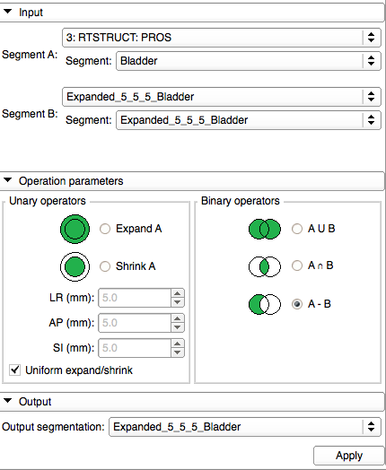

# Segment Morphology

The SegmentMorphology provides morphological operators to perform on structures. The available operators are: Expand, Shrink, Union, Intersect, Subtract.

Author: Kevin Wang (Radiation Medicine Program, Princess Margaret Hospital, University Health Network Toronto), Csaba Pinter (Ebatinca)

## Use Cases

- Apply margin to a target volume
- Unify structures to be able to calculate DVH for an organ group (e.g. optical organs)

Segment Morphology module UI:

## Panels and their use

- Input
  - Reference segment: The input structure that serves as the only input for unary operations and as first input and reference for the binary operations (provides the volume properties for the second one if they differ in this sense). Select segmentation first, then the individual segment
  - Compare contour: The input structure that serves as the second input for the binary operations. Select segmentation first, then the individual segment
- Operation parameters
  - Expand A (unary): expands structure A by the dimensions specified below
  - Shrink A (unary): shrinks structure A by the dimensions specified below
  - A union B (binary): Perform union operation on the structures
  - A intersection B (binary): Perform intersection operation on the structures
  - A subtraction B (binary): Perform subtraction operation on the structures
- Output segmentation: Select or create segmentation that will contain the output. Note: The output segmentation will be cleared and will only contain the segment for the output structure. If the selection is not empty, the user is warned.

## Acknowledgements

This work is part of the SparKit project, funded by An Applied Cancer Research Unit of Cancer Care Ontario with funds provided by the Ministry of Health and Long-Term Care and the Ontario Consortium for Adaptive Interventions in Radiation Oncology (OCAIRO) to provide free, open-source toolset for radiotherapy and related image-guided interventions.
